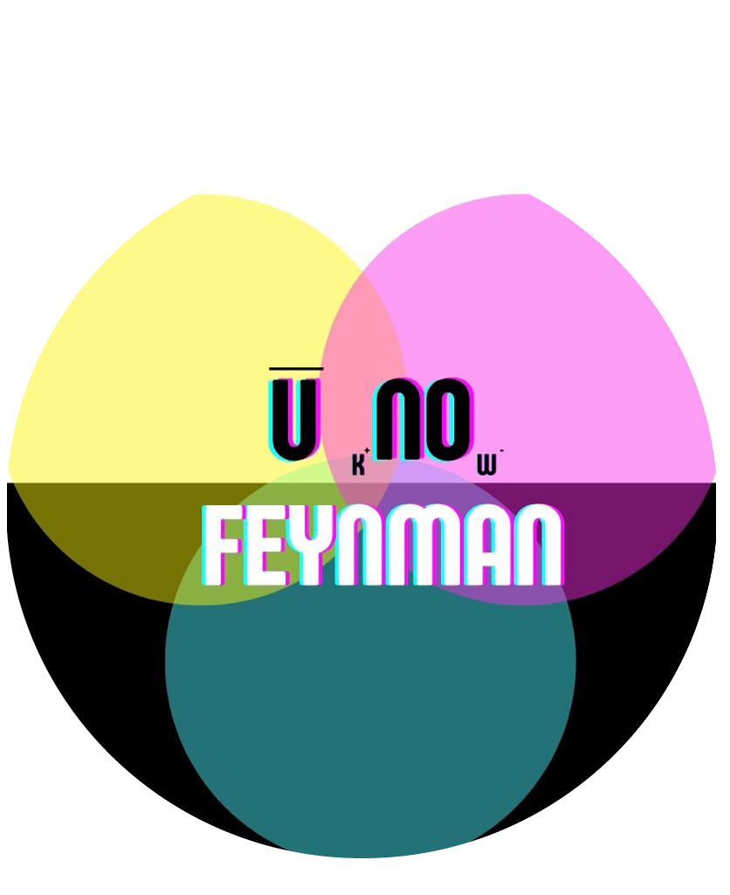

    

# Feynman UNO Flip - A Particle Physics Card Game

Feynman UNO Flip is an educational card game that brings the complexities of particle physics to life through interactive gameplay. Originally developed as a physical card game for a university project in collaboration with lecturers, researchers, and UCL (University College London) Business, this virtual version aims to make the game accessible to a broader audience. Inspired by the interactive sessions held with GCSE and A-Level students, this online version allows players to learn particle physics concepts anywhere in the world.

**Live Game URL:** [uknowfeynman.co.uk](http://www.uknowfeynman.co.uk)  
**Admin Controls Page:** [uknowfeynman.co.uk/admin_controlls_6aSymmetryInPhysics](http://www.uknowfeynman.co.uk/admin_controlls_6aSymmetryInPhysics)

https://github.com/user-attachments/assets/ef893aa7-16bc-4475-8a84-3da9181ae9ca

## Table of Contents

- [Features](#features)
- [Game Rules](#game-rules)
- [Usage](#usage)
- [Admin Controls](#admin-controls)
- [Known Issues and TODOs](#known-issues-and-todos)
- [Contributing](#contributing)

## Features

- **Educational Gameplay**: Learn about particle physics and interactions through strategic card play.
- **Multiplayer**: Play with friends or students from anywhere in the world.
- **Flip Mechanic**: Switch between two sides of the cards, each representing different particle properties.
- **Customizable Game Settings**: Admin controls allow for game management and customization.
- **Interactive Tutorial**: Step-by-step guide to help new players learn the rules and mechanics.

  
  

## Game Rules

The game follows a set of unique rules inspired by particle physics principles:

- **Color and Particle Matching**: Players can play a card that matches the color or particle type of the current card.
- **Boson Rule**: When a boson card is played, the next card must be of the same class as the bottom card.
- **Weak Boson/Photon Rule**: Cards can be played as long as charge conservation holds, and the particle is not a boson.
- **Gluon Rule**: When a gluon is played, the next card must match the particle type exactly.

For a complete list of rules and gameplay mechanics, please refer to the in-game tutorial or the rules section in the app.

https://github.com/user-attachments/assets/60eced3f-f4b1-4dec-a5f2-ffb5bc41ee3b

## Usage
Playing the Game:

- Navigate to the game URL or run it locally.
- Create or join a game.
- Use the interface to draw cards, play cards, and flip the deck.
- Follow the in-game prompts and tutorials to understand the gameplay mechanics.

## Admin Controls

https://github.com/user-attachments/assets/bc5d9f9b-d912-4365-b083-b2ad8908a2b4

Admins can manage games through the admin controls page. The admin interface includes features to:
 - Reset games
 - Remove inactive games
 - Monitor active games and players

## Known Issues and TODOs
- **Animations**: Implement card animations for smoother gameplay.
- **Flip Mechanic**: Currently, flipping doesn't affect other players' views. This might become a feature.
- **Card Highlighting**: When flipping locally, the highlight on cards may not persist.
- **Interactive Instructions**: Improve in-game instructions.
- **Card Positioning on iOS**: Fix card positioning issues on iOS devices.
- **Game Manager**: Add a game manager feature for better control over game sessions.
- **Button Edge Cases**: Address edge cases related to button press timings.
- **Playing and Drawing on a H card**: Sometimes the first click when drawing on a Higgs card draws too many cards. Need to delay time spans between cards being drawn on a Higgs to signify what is happening. Currently cannot play anything to neutralise a Higgs and error messages are confusing.
- **Game Resetting**: Other players visually don't reset correctly - still shows other players as the same amount of cards as before, however this updates as soon as any action is taken (visual update not called when reseting game).
- **Multi-Play Error Messages**: Get an error message saying not your turn when trying multi-play. This should not happen, but does not affect gameplay.

## Contributing
We welcome contributions to enhance the game. Please submit issues and pull requests to the repository. Before contributing, ensure you follow the code of conduct.

##
Developed with ❤️ by the Feynman UNO Flip team.
